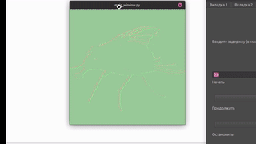

# Структура

- [Структура](#структура)
  - [О чём проект](#о-чём-проект)
  - [Проблемы с зависимостями](#проблемы-с-зависимостями)
  - [Требования](#требования)
    - [Чего не хватает на данный момент/задачи](#чего-не-хватает-на-данный-моментзадачи)
    - [Что следовало бы сделать, переделывая проект](#что-следовало-бы-сделать-переделывая-проект)
  - [Основные логические модули](#основные-логические-модули)
  - [Установка (installation)](#установка-installation)
    - [С локальным окружением (потом снести легче будет)](#с-локальным-окружением-потом-снести-легче-будет)
    - [с глобальным окружением](#с-глобальным-окружением)
  - [Пример работы](#пример-работы)

## О чём проект

## Проблемы с зависимостями

1) не везде можно реализовать клик сквозь окно, в частности, нет проблем с :
   1) windows
   2) x11
      1) xlib

## Требования

бла бла бла, блеблебле, блублублу.

- Связь объектов для печати (как-то связанные...)
  - Сущности для отображения того, что будет печататься
    - возможность трансформаций
      - поворот
      - масштабирование
      - передвижение
  - Сущности для процесса печати (те, что кликают, двигают и прочее)
- Сущность для генерации комманд на выполнение? (клик, нажатие и т.д.)
  - На основе изображения
    - Редактирование изображения
    - фильтры, может, какие-нибудь, в общем генерация некоторого рода сырья
  - На основе уже имеющихся комманд...

Начну, вероятно, с самого банального варианта - преобразуем картинку в команды, а именно pixel клики, чтобы узнать, каково оно, а также один цвет - чёрный

### Чего не хватает на данный момент/задачи

- [ ] нет документации
- [v] виджет визуализации комманд смещается при скрывании/отображении (походу на уровень шапки)
- [ ] поток с исполнением команд не даёт знать о завершении выполнения команд, как следствие, виджет визуализации команд не отображается
- [ ] алгоритмы фильтрации не распараллелены (лагает)
- [ ] нет многопоточности для фильтрации -> лагает интерфейс
- [ ] hotkeys берутся из виджета хардкорного
- [ ] ничего из конфигурации не сохраняется при выключении
- [v] всё в отдельных окнах, собрать в единый виджет
- [ ] файла зависимостей
- [ ] добавить перевод из одной ColorScheme в другую (чтобы в фильтрах по умолчанию использовать)
- [ ] определиться с форматом. Почему фильтры работают противно интуиции (где чёрное, там белое, а где белое, оказывается чёрное)
- [ ] объекты параметризации из json не могут захавать float значение из default опции, если в ней лежит int (1 не проходит, 1.0 проходит, например)
- [ ] при трансформациях  (поворот + масштабирование) сбивается центр почему-то, слишком отстойная реализация CommandsTransformator
- [ ] объединить всё в один виджет
- [ ] загрузка картинки на лету
- [ ] сохаранение конфигурации при настройках алгоритмов?
- [ ] отображается нерабочий функционал у виджетов
- [ ] все строки в файлы локализации, чтобы был не один язык
- [v] нет демонстрации
- [ ] замутить пакеты, чтобы не было идентичных постоянных длинных строк импорта
- [ ] image_visualizer не растягивается при открытии новых картинок, смотрится не оч

### Что следовало бы сделать, переделывая проект

- пересмотреть модуль для итерации/генерации команд, чтобы:
  - класс для генерации комманд делал это на лету по желанию (вдруг команд много)
  - класс генерации комманд был теснее или гибче связан с трансформациями (иначе количество точек разряжается/повышает концентрацию при масштабировании, например.)
- возможность записи макросов для смены цветов

## Основные логические модули

## Установка (installation)

python 3.12?

sudo apt install build-essential python3-dev
sudo apt install gcc
sudo apt install libxcb-cursor0


### С локальным окружением (потом снести легче будет)

Linux

```bash
cd Clyaksa
python -m venv ./venv
source ./venv/bin/activate
pip install -r requirements.txt
python ./source/main_window.py
```

### с глобальным окружением

```bash
cd Clyaksa
pip install -r requirements.txt
python ./source/main_window.py
```

## Пример работы

(можно немного нацелится, будет рисовать под силуэтом зелёного окна)


